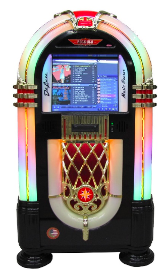

# Problem Statement – Jukebox Part-1



In this challenge you will use linked lists to model a Music Jukebox. Music jukeboxes were commonly used in restaurants and bars to enable customers to choose what music is being played. For a nominal charge, a customer could choose a song of their liking from a list of songs that was available on the jukebox. Remember, jukeboxes were invented even before digital music came into existence – and certainly much before streaming music became the available. From the 70’s and 80’s electronic and digital jukeboxes started becoming prevalent. A modern jukebox is most likely to be fully computerized and will play music stored on a local hard-disk or may even be able to stream music from the internet directly.

Let us look at some of the functions that a modern music jukebox is expected to support:

1.	A catalog of music that is properly organized for user-friendly search and access
    -	By Artist (Individual or a Group Name)
    -	By Album
    -	By Genre, etc.


2.	Ability to search for music based on any of the categories above. Once a category is specified, an alphabetical search can be offered to the user to locate the music they are looking for

3.	Allowing the user to add a song or a particular album to the current playlist. The music jukebox may have rules to prevent a single user from choosing too many songs, so that all customers have a fair chance of listening to a song of their choice

4.	In a commercial establishment, there may be a small fee that has to be paid to add a song to the playlist. This may be a configurable option in the jukebox. In case payments are required, the jukebox has to offer some payment mechanisms. Originally, jukeboxes were designed to accept only coins. Nowadays, they may accept tokens which can be purchased from the cash counter, or the modern ones may directly accept credit cards and debit cards.

5.	For home or personal use, a jukebox can even have functions to manage the play list. For example, 

-	Rewind to the beginning of the current song
-	Skip back to the previous song
-	Skip forward to the next song, etc.

6.	Display of the current playlist. It should indicate the songs that have been played, the current song that is playing with the time remaining in mm:ss format and the list of songs that have been queued up for playing subsequently

7.	In case customers are not making any choices, a music jukebox may also have a function to shuffle songs (select randomly) from the catalog and play them. Or it could have a function where a genre can be specified viz., “Jazz” and songs are then randomly selected from the subset of the catalog that contain Jazz music.

8.	In the future it may not be surprising to find music jukeboxes that are voice or “Alexa” enabled. Or at least understand natural language inputs such as “Can you play music from the movie Sholay ?” 

### Task 1

Design a class called MusicItem that will be used to model entries in your music catalog. This class will be used to instantiate objects used for storing catalog information about the music that is featured in the catalog. 

Typically, music is released either in the form of Singles (a single song) or an Album (a compilation of songs). In case an album is released, it is given a name over and above the names of the individual songs that are in the album. In the case of singles there is just the name of the song itself.

To catalog the music and make it easy to search, there are a couple of attributes that are crucial:

-	Artist: This can be an individual, for example “Michael Jackson”; Or it can be the name of a group, for example, “The Spice Girls”

-	Genre: This indicates the type of music the album/single represents, for example “Pop”, or “Rock”, or “Jazz”, or “Rap”, or “Classical”, or “Blues”, or “Country”, etc.

Other attributes that may be useful to include are:

-	Year in which the music item was released
-	Number of songs in case it is an album
-	Total playing time in hh:mm:ss (sum of the playing time of all the songs in the album or the playing time of the single)

So, for example a catalog entry could be organized as:

Release Type, Artist, Music Item Name, Genre, Year of Release, Number of Songs, Total Playing Time

Examples of entries in this format would be:

```
Album, Dire Straits, Brothers in Arms, Rock, 1985, 9, 00:55:00
Album, The Complete Greatest Hits, America, Pop/Rock, 2001, 18, 00:59:00
Album, Creedence Clearwater Revival, Cosmo’s Factory, Rock, 1970, 10, 00:36:00
Single, Taylor Swift, Shake It Off, Pop, 2014, 1, 00:03:39
Single, Taylor Swift, Love Story, Pop, 2008, 1, 00:03:55
Album, Taylor Swift, Reputation, Pop, 2017, 31, 01:24:00
Album, Louis Armstrong, The Very Best of Louis Armstrong, Jazz, 1998, 40, 02:16:00
Album, Michael Jackson, Thriller, Pop, 1982, 9, 00:42:00
Album, Spice Girls, Spice World, Pop, 1997, 10, 00:38:00
```
Now design a class called MusicCatalog that can be used to create a doubly linked list of music items of the type MusicItem that are in the music catalog.

### Task 2

Write a method that can be used to read a music catalog file and create a music catalog in the form of a doubly linked list in memory. If the operation is successful, the method should return a true value back to the calling program; else it should return a false value. 

    boolean readMusicCatalog(String filename);

Note that it will be beneficial to sort the music items as they are added to the list. You can sort them on the basis of the Artist first (alphabetical order) and then based on the Year of Release (ascending order).

To help you compare 2 music items and decide which comes first in alphabetical order of Artist + Year of Release, write the following method:

	boolean isInAscendingOrder(MusicItem newItem);

This method should return true if firstItem should come first else it should return false. Based on the return value you can decide whether the newItem should be inserted just before the currentItem or not.

A file named “music-catalog.csv” has been provided for you to test your program. 

### Task 3

Enhance your MusicItem class by adding a method for showing the details of a music item:

	void showDetails();


Create the following method for displaying the contents of the music catalog with the help of the following enum type:

enum Direction {FORWARD, REVERSE};

	void showMusicCatalog(Direction direction);

When the value of the parameter direction is Direction.FORWARD, the music catalog should be shown in the forward direction from the beginning. Conversely, when the direction is Direction.REVERSE, the music catalog should be shown in the reverse direction from the last music item.


### Task 4 

Now write a main method that interactively asks the user to enter their preferences and displays the portion of the catalog which matches their preference. For example:

 Display by:

1.	Artist – Get the artist name from the user and then display all music items by the chosen artist

2.	Genre – Get the genre from the user and display all music items matching the genre chosen by the user. 

3.	By Album Name or Song Name – Get a name from the user and display all music items that match the name specified by the user

