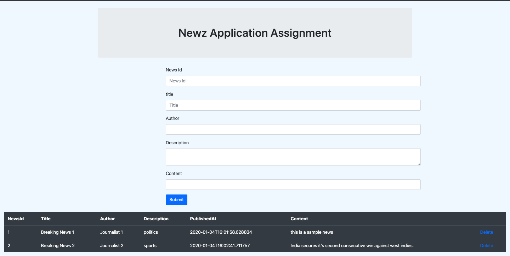

 

## Seed code - Boilerplate for step 1 - Newz Assignment

### Assignment Step Description

As a first step in building our Newz application, we will create a monolithic application. 

A monolithic application is built as a single unit. Enterprise Applications are built in three parts: 
1. A database (consisting of many tables usually in a relational database management system), 
2. A client-side user interface (consisting of HTML pages and/or JavaScript running in a browser), 
3. A server-side application. 

This server-side application will handle HTTP requests, execute some domain specific logic, retrieve and update data from the persistence storage, and populate the HTML views to be sent to the browser. 

### Problem Statement

In this case study: Newz Step 1, we will develop a monolithic application which will get the news Id,title, author, description and content from the user using a form (JSP/HTML), add current timestamp and persist the data in Array List and display all news with details such as news id,news title, author, description and news content LocalDateTime of posting in a reverse chronological order (latest News first). It will also allow the user to delete any of the news.

**Note: For detailed clarity on the class files, kindly go thru the Project Structure**
### Expected solution
 A form containing five text fields for News ID, News Title, Author, Description, News content and a submit button, below to this will be a table with column containing fields News ID, Title, Author, Description, News Content and LocalDateTime(This will be published in reverse chronological order). 
 When the user enters the News ID, Title, Author, Description, News Content and clicks on submit button, it gets stored in the array list and later render in tabular column along with a delete button.

 
 
### Following are the broad tasks:
1. Display the list of news from the array list. Each news should contain News ID, Title, Author, Description, News Content and created date. 
2. Add a new news which should contain the News ID, Title, Author, Description, News Content.
3. Delete any existing news based on the news ID.
4. Make sure to pass all the Unit test cases locally and on Hobbes.

### Steps to be followed :

    Step 1: Clone the boilerplate in a specific folder in your local machine and import the same in your eclipse STS.
    Step 2: Add relevant dependencies in pom.xml file. 
        Note: Read the comments mentioned in pom.xml file for identifying the relevant dependencies.
    Step 3: In resources/beans.xml, add the required bean elements for News model and NewsRepository class.
    Step 4: Go through web.xml
    Step 5: In dispatcher-servlet.xml, add base packages to scan and define the bean for view resolver.
    Step 6: In News.java file (which is considered as Model class), declare all the necessary variables for the model.
    Step 7: In NewsRepository.java, create methods to add/retrieve/update/delete news from the Array List. 
       Also Write a method which is used to retrieve all news from array list.
    Step 8: Run the test cases for NewsRepository(NewsRepositoryTest.java)
    Step 9: In NewsController.java, get the application context from resources/beans.xml file using ClassPathXmlApplicationContext() class. Also get News and NewsRepository objects from the application context. Annotate the NewsController.java with @Controller annotation.
    	Define a handler method to read the existing news from the ArrayList, to read the News data from requested parameters and save the new news in the Array List and delete a news.
    Step 10: Run the testcases for NewsController (NewsControllerTest.java)
    Step 11: Design a form with five text boxes (News id, title, author, description and content) and a submit button and A table which shows News Id, title, author, description, content and the created date.

### Project structure

The folders and files you see in this repositories, is how it is expected to be in projects, which are submitted for automated evaluation by Hobbes

    Project
	|
	├──src/main
	|	└─java
	|       └── com.stackroute.newz.controller
	|		       └── NewsController.java 		        // This class is used to control all the transactions with the persistence storage.
	|       └── com.stackroute.newz.model
	|		       └── News.java                    	// The class will be acting as the data model for the News data in the persistence storage. 
	|       └── com.stackroute.newz.repository
	|		       └── NewsRepository.java          	// This class contains the code for data interactions and methods of this class will be used by other 
	|                                                        parts of the applications such as Controllers and Test Cases               
	|   └── resources
	|		    └── beans.xml               	     	// This is a XML configuration file for bean objects definition
	|	└── webapp/WEB-INF
	|				└──	dispatcher-servlet.xml		    // This is a XML configuration file required to define bean for View Resolver for the application
	|				└── web.xml					    	// This is a XML configuration file required to configure the servlet an servlet-mapping elements
	|   └── webapp/WEB-INF/views
	|		    			└── index.jsp               // A JSP page with a form and table in it, form will have textboxes for News properties along with a Send Submit button. 
	|                                                   Table will contain fields namely News id, title, author, description, content and created date which will render all the informantion from the persistence store.
	|
	├──src/test/java
		    └── com.stackroute.newz.test.repository
	|		       └── NewsRepositoryTest.java       	// All your repository test cases are written using JUnit, these test cases can be run by selecting Run As -> JUnit Test
  		  └── com.stackroute.newz.test.controller
	|		       └── NewsControllerTest.java       	// All your test cases related to the controller are written using JUnit, these test cases can be run by selecting Run As -> JUnit Test
  		  └── com.stackroute.newz.test.model
	|		       └── NewsTest.java       	// All your test cases related to the entity(model) are written using JUnit, these test cases can be run by selecting Run As -> JUnit Test
	|
	├── .settings
	├── .classpath			                            // This file is generated automatically while creating the project in eclipse
	├── .hobbes   			                            // Hobbes specific config options, such as type of evaluation schema, type of tech stack etc., Have saved a default values for convenience
	├── .project			                            // This is automatically generated by eclipse, if this file is removed your eclipse will not recognize this as your eclipse project. 
	├── pom.xml 			                            // This is a default file generated by maven, if this file is removed your project will not get recognised in hobbes.
	└── README.md  		                    	        // This files describes the problem of the assignment/project, you can provide as much as information and clarification you want about the project in this file

> PS: All lint rule files are by default copied during the evaluation process, however if need to be customizing, you should copy from this repo and modify in your project repo

#### To use this as a boilerplate for your new project, you can follow these steps

1. Clone the base boilerplate in the folder **newz-step1-boilerplate** of your local machine
     
    `git clone https://gitlab-ibm.stackroute.in/stack_java_newz/newz-step1-boilerplate.git`

2. Navigate to newz-step1-boilerplate folder

    `cd newz-step1-boilerplate`

3. Remove its remote or original reference

     `git remote rm origin`

4. Create a new repo in gitlab named `assignment-solution-step1` as private repo

5. Add your new repository reference as remote

     `git remote add origin <CADET-REPO>`

6. Check the status of your repo 
     
     `git status`

7. Use the following command to update the index using the current content found in the working tree, to prepare the content staged for the next commit.

     `git add .`
 
8. Commit and Push the project to git

     `git commit -a -m "Initial commit | or place your comments according to your need"`

     `git push -u origin master`

9. Check on the git repo online, if the files have been pushed

### Important instructions for Participants
> - We expect you to write the assignment on your own by following through the guidelines, learning plan, and the practice exercises
> - The code must not be plagirized, the mentors will randomly pick the submissions and may ask you to explain the solution
> - The code must be properly indented, code structure maintained as per the boilerplate and properly commented
> - Follow through the problem statement shared with you

### MENTORS TO BEGIN REVIEW YOUR WORK ONLY AFTER ->
> - You add the respective Mentor as a Reporter/Master into your Assignment Repository
> - You have checked your Assignment on the Automated Evaluation Tool - Hobbes (Check for necessary steps in your Boilerplate - README.md file. ) and got the required score - Check with your mentor about the Score you must achieve before it is accepted for Manual Submission.
> - Intimate your Mentor on Slack and/or Send an Email to learner.support@stackroute.in - with your Git URL - Once you done working and is ready for final submission.

### Further Instructions on Release

*** Release 0.1.0 ***

- Right click on the Assignment select Run As -> Run on Server to run your Assignment.
- Right click on the Assignment select Run As -> JUnit Test to run your Assignment.
